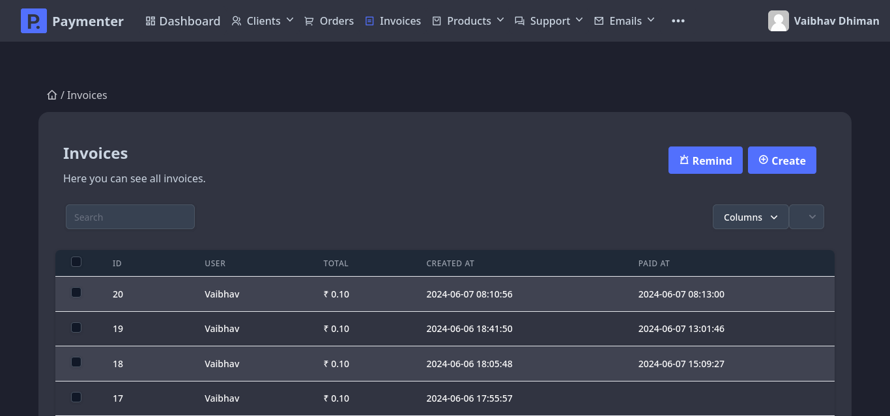
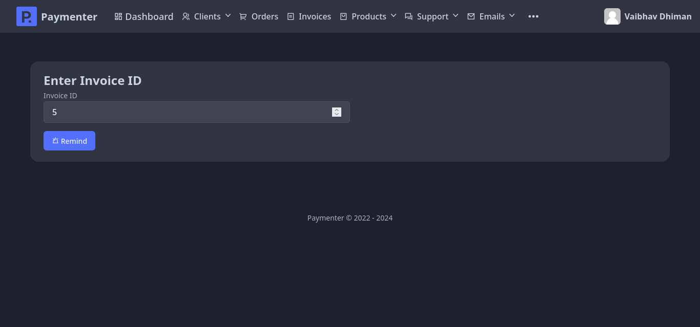
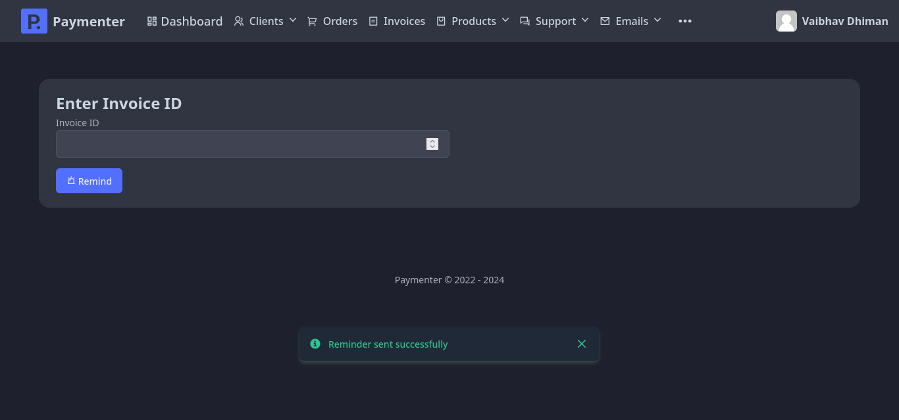
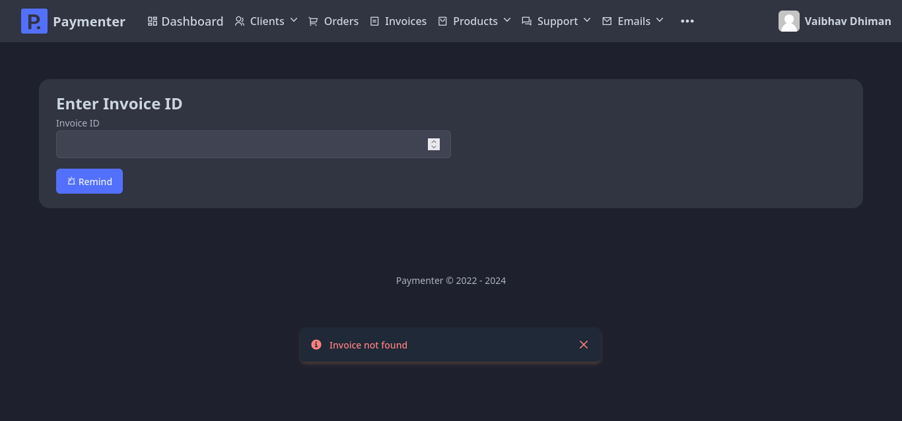

# Invoice Reminder
This extension allows you to remind users about their unpaid invoices. You can enter a invoice ID and it will send a reminder to that user about the invoice.

Sample Screenshots

Invoices:

Remind:

Remind Success:

Remind Fail:

## Getting Started
1. Install the extension
1. Run `curl -o - https://raw.githubusercontent.com/VaibhavSys/InvoiceReminder-Extension/master/setup.sh | bash` in root paymenter directory (usually `/var/www/paymenter`). Run as root if you get a permission error.
1. Done!

## Additional Information
This project is licensed under the terms of the MIT license. For more details, see the [LICENSE](LICENSE) file in the repository. The source code for this project is available on GitHub. You can access it [here](https://github.com/VaibhavSys/InvoiceReminder-Extension).
